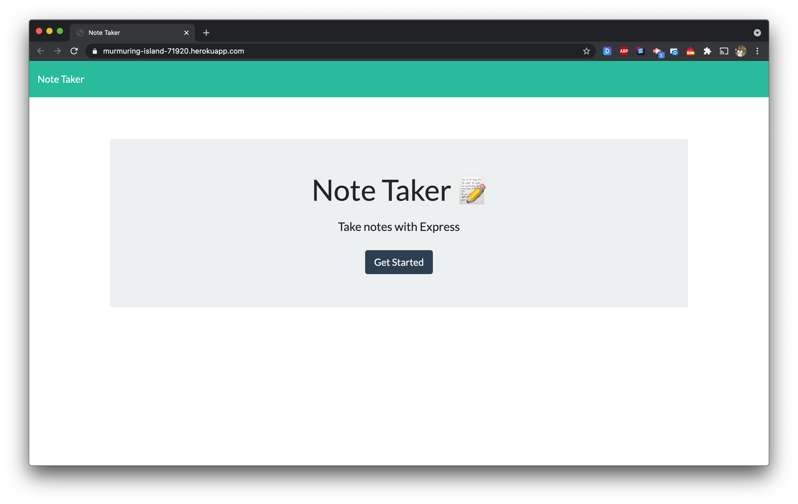
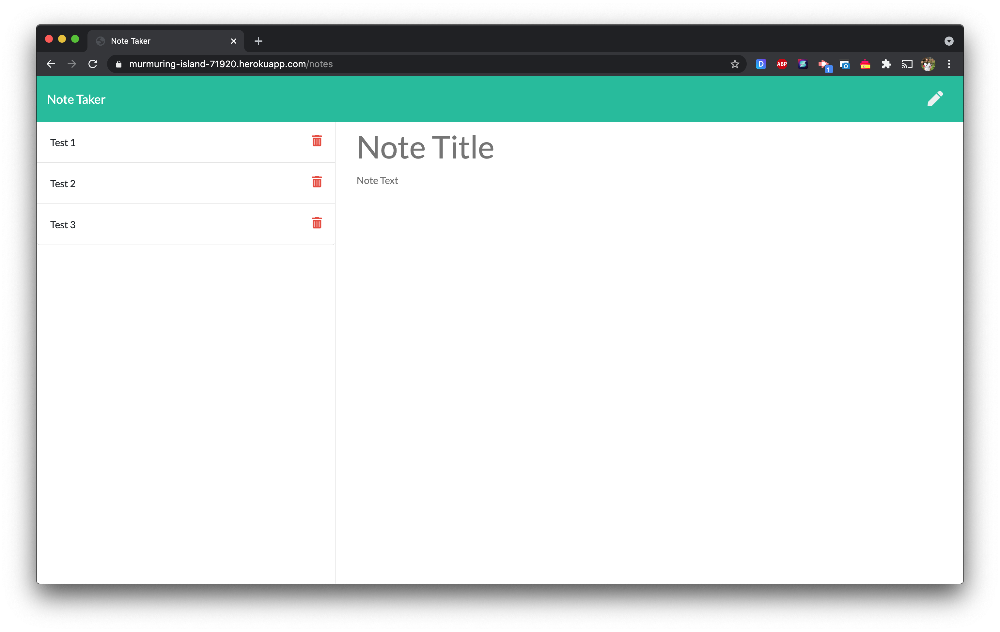

# Note Taker
  
  ## Table of contents  
  - [Description](#description)
  - [Installation](#installation)
  - [Usage](#usage)
  - [License](#license)
  - [Contributing](#contributing)
  - [Questions](#questions)
  - [Deployed](#deployed)

  ## Description
  This repository contains an application called Note Taker to write and save notes. This application uses an Express.js back end and saves and retrieves note data from a JSON file.

  ## Installation
  After copying the repository please run “npm install” to install the inquirer package.

  ## Usage
  A landing page will be presented with a link to the notes page. When you click on the button, a page will be presented with the existing notes listed in the left-hand column, plus empty fields to enter a new note title and the note’s text in the right-hand column. When title and text are entered, the save icon appears in the navigation at the top of the page and once it's clicked, the new note entered is saved and appears in the left-hand column with the other existing notes. Each note can be deleted clicking the delete icon.

  
  

  ## License
  
  This project is licensed under MIT license.
  
  ---

  ## Contributing
  Contributions, issues and feature requests are welcome.

  ## Questions
  Github: <a href="https://github.com/itsraulsanz/">https://github.com/itsraulsanz/</a>  

  ## Deployed Application

  Website URL: <a href="https://murmuring-island-71920.herokuapp.com/">https://murmuring-island-71920.herokuapp.com/</a>